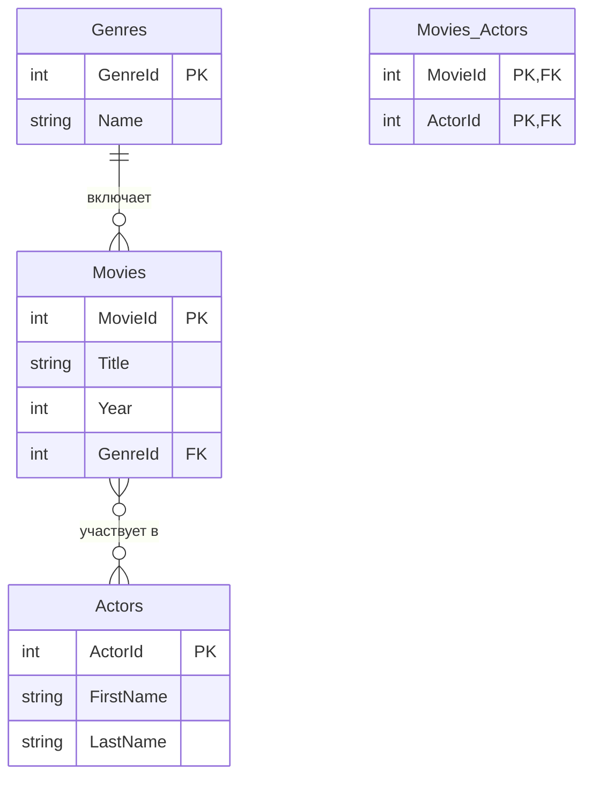
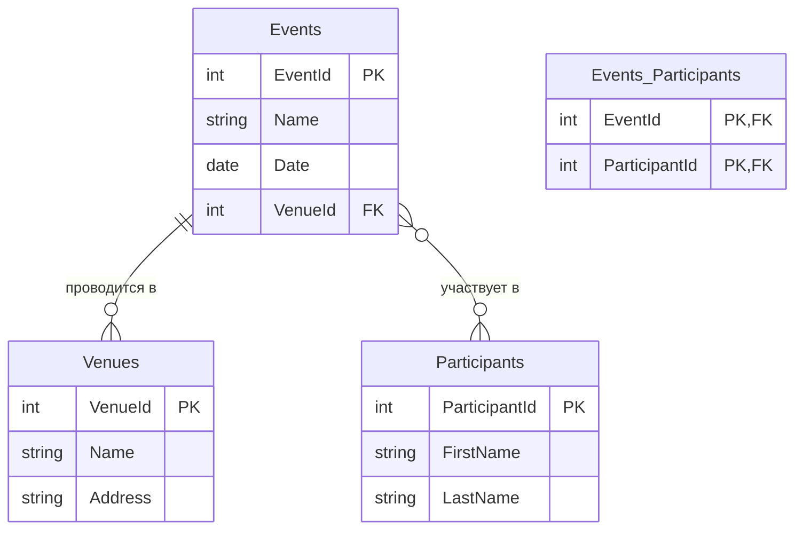

# Заголовок украли цыгане
# Интеграция контекстов и LINQ-запросов в Entity Framework Core
  


**Все отправляются на завод**

---

##  Интеграция 2 контекстов

  

```csharp

using UltimateProject.Data;

using UltimateProject.Models;

using Microsoft.EntityFrameworkCore;

using System.IO;

  

namespace UltimateProject

{

    internal class Program

    {

        static void Main()

        {

            // 🎯 СОЗДАЕМ ДВА НЕЗАВИСИМЫХ КОНТЕКСТА

            using var genericContext = new GenericContext();

            using var alterContext = new AlterContext();

  

            // 🗑️ ОЧИСТКА И СОЗДАНИЕ БАЗ

            genericContext.Database.EnsureDeleted();

            genericContext.Database.EnsureCreated();

            alterContext.Database.EnsureDeleted();

            alterContext.Database.EnsureCreated();

  

            // 📊 ИНФОРМАЦИЯ О БАЗАХ

            Console.WriteLine($"Generic база: {Path.GetFullPath("generic_database.db")}");

            Console.WriteLine($"Alter база: {Path.GetFullPath("alter_database.db")}");

  

            // 📝 СОЗДАНИЕ ДАННЫХ В GENERIC

            var genericEntities = new List<MainEntity>

            {

                new() { Name = "Generic Конференция", Description = "IT события", Location = "Москва" },

                new() { Name = "Generic Фестиваль", Description = "Живая музыка", Location = "СПб" }

            };

  

            genericContext.MainEntities.AddRange(genericEntities);

            genericContext.SaveChanges();

  

            // 📝 СОЗДАНИЕ ДАННЫХ В ALTER

            var alterEntities = new List<MainEntity>

            {

                new() { Name = "Alter Симпозиум", Description = "Научные исследования", Location = "Новосибирск" },

                new() { Name = "Alter Выставка", Description = "Искусство", Location = "Казань" }

            };

  

            alterContext.MainEntities.AddRange(alterEntities);

            alterContext.SaveChanges();

  

            // 🔥 ПРАВИЛЬНЫЕ LINQ ЗАПРОСЫ ДЛЯ КАЖДОГО КОНТЕКСТА

Console.WriteLine("\n=== GENERIC КОНТЕКСТ ===");
var genericAll = (from entity in genericContext.MainEntities
                  select entity).ToList();

foreach (var g in genericAll)
{
    Console.WriteLine($"   {g.Name} - {g.Location}");
}

Console.WriteLine("\n=== ALTER КОНТЕКСТ ===");
var alterAll = (from entity in alterContext.MainEntities
                select entity).ToList();

foreach (var a in alterAll)
{
    Console.WriteLine($"   {a.Name} - {a.Location}");
}

Console.WriteLine("\n=== ОБЪЕДИНЕННЫЕ РЕЗУЛЬТАТЫ ===");
var allEntities = (from entity in genericAll.Concat(alterAll)
                   orderby entity.Name
                   select entity).ToList();

foreach (var e in allEntities)
{
    Console.WriteLine($"   {e.Name} ({e.Location})");
}
```

  

---

  

## Интеграция 1 контекста

  

```csharp

using UltimateProject.Data;

using UltimateProject.Models;

using Microsoft.EntityFrameworkCore;

using System;

using System.Collections.Generic;

using System.Linq;

using System.IO;

  

namespace UltimateProject

{

    internal class Program

    {

        static void Main()

        {

            using var context = new GenericContext();

            // 🗑️ Очистка и создание БД

            context.Database.EnsureDeleted();

            context.Database.EnsureCreated();

            var connection = context.Database.GetDbConnection();

            if (connection.DataSource != null)

                Console.WriteLine($"База данных: {Path.GetFullPath(connection.DataSource)}");

  

            // 📝 СОЗДАНИЕ ДАННЫХ

            var mainEntities = new List<MainEntity>

            {

                new() { Name = "Технологическая Конференция", Description = "IT события", Location = "Москва" },

                new() { Name = "Музыкальный Фестиваль", Description = "Живая музыка", Location = "Санкт-Петербург" },

                new() { Name = "Научный Симпозиум", Description = "Исследования", Location = "Новосибирск" }

            };

  

            var relatedEntities = new List<RelatedEntity>

            {

                new() { Name = "Анна Иванова", Email = "anna@test.com" },

                new() { Name = "Борис Петров", Email = "boris@test.com" },

                new() { Name = "Светлана Сидорова", Email = "svetlana@test.com" },

                new() { Name = "Дмитрий Козлов", Email = "dmitry@test.com" }

            };

  

            context.MainEntities.AddRange(mainEntities);

            context.RelatedEntities.AddRange(relatedEntities);

            context.SaveChanges();

  

            // 🔗 СОЗДАНИЕ СВЯЗЕЙ

            mainEntities[0].RelatedEntities.Add(relatedEntities[0]);

            mainEntities[0].RelatedEntities.Add(relatedEntities[1]);

            mainEntities[0].RelatedEntities.Add(relatedEntities[2]);

            mainEntities[1].RelatedEntities.Add(relatedEntities[1]);

            mainEntities[1].RelatedEntities.Add(relatedEntities[3]);

            mainEntities[2].RelatedEntities.Add(relatedEntities[0]);

            mainEntities[2].RelatedEntities.Add(relatedEntities[2]);

            mainEntities[2].RelatedEntities.Add(relatedEntities[3]);

  

            context.SaveChanges();

  

            // 🔥 LINQ ЗАПРОСЫ

            ...

        }

    }

}

```

  

---

  

## ⚡ ЭКСПРЕСС-КОД

  

###  Создание БД + данные

  

```csharp

using var context = new AppContext();

context.Database.EnsureDeleted();

context.Database.EnsureCreated();

  

var mains = new List<MainEntity>

{

    new() { Name = "Объект 1", Description = "Описание 1" },

    new() { Name = "Объект 2", Description = "Описание 2" }

};

  

var relateds = new List<RelatedEntity>

{

    new() { Name = "Связанный 1", Email = "test1@mail.com" },

    new() { Name = "Связанный 2", Email = "test2@mail.com" }

};

  

context.MainEntities.AddRange(mains);

context.RelatedEntities.AddRange(relateds);

context.SaveChanges();

```

  

###  Связи

  

```csharp

mains[0].RelatedEntities.Add(relateds[0]);

mains[0].RelatedEntities.Add(relateds[1]);

mains[1].RelatedEntities.Add(relateds[0]);

context.SaveChanges();

```

  

### Запросы

  

```csharp

context.MainEntities.ToList().ForEach(x => Console.WriteLine(x.Name));

  

context.MainEntities

    .Include(m => m.RelatedEntities)

    .ToList()

    .ForEach(m => Console.WriteLine($"{m.Name}: {m.RelatedEntities.Count}"));

  

context.MainEntities

    .GroupBy(m => m.Name)

    .Select(g => new { Name = g.Key, Count = g.Count() })

    .ToList()

    .ForEach(x => Console.WriteLine($"{x.Name}: {x.Count}"));

  

context.MainEntities

    .Where(m => m.RelatedEntities.Count > 1)

    .ToList()

    .ForEach(m => Console.WriteLine(m.Name));

```

  

---

  

##  Linq запросы

  

### 🔹 Базовые

  

```csharp

// 🔥 ИСПРАВЛЕННЫЕ LINQ ЗАПРОСЫ

// Получение всех записей
var all = (from entity in context.MainEntities
           select entity).ToList();

// Поиск по ID (Find не является LINQ методом, это метод DbContext)
var byId = context.MainEntities.Find(1);

// Получение первых N записей
var firstN = (from entity in context.MainEntities
              select entity).Take(5).ToList();

// Сортировка по имени
var sorted = (from entity in context.MainEntities
              orderby entity.Name
              select entity).ToList();

```

  

### 🔹 Связи

  

```csharp

// 🔥 ИСПРАВЛЕННЫЕ LINQ ЗАПРОСЫ С ВКЛЮЧЕНИЕМ И АГРЕГАЦИЕЙ

// Запрос с включением связанных сущностей
var withRelations = (from entity in context.MainEntities.Include(m => m.RelatedEntities)
                     select entity).ToList();

// Запрос с проекцией и подсчетом количества связанных сущностей
var withCounts = (from entity in context.MainEntities
                  select new 
                  { 
                      entity.Name, 
                      Count = entity.RelatedEntities.Count 
                  }).ToList();

// Запрос с фильтрацией по количеству связанных сущностей
var withManyRelations = (from entity in context.MainEntities
                         where entity.RelatedEntities.Count >= 2
                         select entity).ToList();

```

  

### 🔹 Группировки

  

```csharp

// 🔥 РАСШИРЕННЫЕ ГРУППИРОВКИ В LINQ QUERY SYNTAX

// Группировка по нескольким полям
var multiFieldGroup = (from entity in context.MainEntities
                       group entity by new { entity.Description, entity.Category } into g
                       select new
                       {
                           Description = g.Key.Description,
                           Category = g.Key.Category,
                           Count = g.Count(),
                           FirstItem = g.First().Name
                       }).ToList();

// Группировка с фильтрацией до агрегации
var filteredGroup = (from entity in context.MainEntities
                     where entity.IsActive
                     group entity by entity.Description into g
                     where g.Count() >= 5  // фильтрация групп
                     select new
                     {
                         Description = g.Key,
                         Count = g.Count(),
                         MaxValue = g.Max(x => x.SomeValue)
                     }).ToList();

// Группировка с сортировкой результатов
var sortedGroups = (from entity in context.MainEntities
                    group entity by entity.Description into g
                    orderby g.Count() descending, g.Key
                    select new
                    {
                        Description = g.Key,
                        Count = g.Count(),
                        AvgAge = g.Average(x => x.Age)
                    }).ToList();

```

  

---

  

## Ошибки(распространенные)

  

**Database is locked**  

→ Отключись от базы (DBeaver/Rider/DataGrip) и перезапусти код  

**No such table**  

→ Проверь имена таблиц в `OnModelCreating`  

**Lazy Loading не работает**  

→ Добавь `virtual` к навигационным свойствам и `UseLazyLoadingProxies()`  

  

---

  

## Полезные методы (ну или не очень полезные кому как)

  

```csharp

// 🔥 НИЗКОУРОВНЕВОЕ ВЗАИМОДЕЙСТВИЕ С БАЗОЙ ДАННЫХ

// Получение низкоуровневого соединения с базой данных
var connection = context.Database.GetDbConnection();

// Вывод информации о сервере базы данных (например: localhost, имя файла SQLite и т.д.)
Console.WriteLine($"База: {connection.DataSource}");
Console.WriteLine($"База данных: {connection.Database}");
Console.WriteLine($"Тип сервера: {connection.GetType().Name}");

// Получение метаданных всех сущностей (таблиц), зарегистрированных в контексте
var tables = context.Model.GetEntityTypes();

// Перебор всех таблиц и вывод их имен
Console.WriteLine("\n=== ТАБЛИЦЫ В КОНТЕКСТЕ ===");
foreach (var table in tables)
    Console.WriteLine($"Таблица: {table.GetTableName()}");

// Создание LINQ-запроса в правильном синтаксисе
var query = from entity in context.MainEntities
            where entity.Id == 1
            select entity;

// Получение SQL-кода, который будет выполнен для этого запроса
Console.WriteLine("\n=== SQL ЗАПРОС ===");
Console.WriteLine(query.ToQueryString());

// Дополнительные низкоуровневые операции
Console.WriteLine("\n=== ДОПОЛНИТЕЛЬНАЯ ИНФОРМАЦИЯ ===");

// Получение информации о поставщике базы данных
var providerName = context.Database.ProviderName;
Console.WriteLine($"Провайдер: {providerName}");

// Проверка возможности подключения
try
{
    connection.Open();
    Console.WriteLine($"Состояние подключения: {connection.State}");
    connection.Close();
}
catch (Exception ex)
{
    Console.WriteLine($"Ошибка подключения: {ex.Message}");
}

```

  

---

  

## Алгоритм

  

1. Создай модели и контекст  

2. Заполни данными и создай связи  

3. Сделай 3–5 LINQ-запросов  

4. Проверь и выведи результаты  

  

---

  

##  Схемы баз данных

  

### Фильмы и актёры

  



### 🎟 События и участники

  



  

---

  

##  ПАКЕТЫ

  

### SQLite

- Microsoft.EntityFrameworkCore.Sqlite

  

### MS SQL

- Microsoft.EntityFrameworkCore.SqlServer

  

### PostgreSQL

- Npgsql.EntityFrameworkCore.PostgreSQL

  

### MySQL

- Pomelo.EntityFrameworkCore.MySql

  

### Общие

- Microsoft.EntityFrameworkCore

- Microsoft.EntityFrameworkCore.Abstractions

- Microsoft.EntityFrameworkCore.Analyzers

- Microsoft.EntityFrameworkCore.Design

- Microsoft.EntityFrameworkCore.InMemory

- Microsoft.EntityFrameworkCore.Proxies
